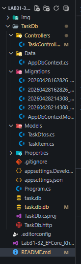

## Лабораторная работа №31-32: Entity Framework Core + SQLite

**ФИО:** Ханов В.В.

**Группа:** ИСП-231

**Дата:** 28.04.2026

---

### Краткое описание

Сделал REST API для управления задачами с помощью ASP.NET Core и Entity Framework Core. Вместо хранения задач в памяти (как раньше) теперь использую SQLite — данные сохраняются в файл taskdb.db и не пропадают после перезапуска. Научился работать с миграциями, LINQ-запросами к БД и асинхронными методами.

---

### Полезные команды dotnet ef

- `dotnet ef migrations add <Name>` — создать миграцию
- `dotnet ef database update` — применить миграции к БД
- `dotnet ef migrations list` — показать список миграций
- `dotnet ef migrations remove` — удалить последнюю миграцию
- `dotnet ef database update <MigrationName>` — откатиться до миграции
- `dotnet ef migrations script` — сгенерировать SQL скрипт

---

### Структура проекта

---

### Реализованные маршруты

- `GET /api/tasks` — получить все задачи (с фильтрацией по статусу и приоритету)
- `GET /api/tasks/{id}` — получить задачу по id
- `POST /api/tasks` — создать задачу
- `PUT /api/tasks/{id}` — обновить задачу
- `PATCH /api/tasks/{id}/complete` — переключить статус (выполнено/не выполнено)
- `DELETE /api/tasks/{id}` — удалить задачу
- `GET /api/tasks/search` — поиск по тексту, приоритету и статусу
- `GET /api/tasks/stats` — получить статистику по задачам
- `GET /api/tasks/paged` — пагинация (страницы)
- `GET /api/tasks/overdue` — получить просроченные задачи
- `PATCH /api/tasks/complete-all` — выполнить все невыполненные задачи
- `DELETE /api/tasks/completed` — удалить все выполненные задачи

---

## Миграции

| Название | Что добавили |
|----------|--------------|
| `InitialCreate` | Таблица Tasks с полями Id, Title, Description, IsCompleted, CreatedAt, Priority + начальные 3 задачи |
| `AddDueDateToTask` | Поле DueDate (срок выполнения) |

---

### Сравнительная таблица LINQ vs SQL

| Аспект | LINQ | SQL |
|--------|------|-----|
| Синтаксис | Методы C# (Where, OrderBy, Select) | Ключевые слова (WHERE, ORDER BY, SELECT) |
| Типизация | Строгая, проверка на этапе компиляции | Динамическая, ошибки только при выполнении |
| Порядок написания | Сначала фильтр, потом сортировка | Сначала SELECT, потом WHERE |
| Работа с объектами | Работает с коллекциями объектов | Работает с таблицами и строками |
| Генерация запроса | EF Core сам переводит в SQL | Пишется вручную |
| Переносимость | Один код работает с разными БД | Запросы зависят от конкретной БД |
| Отладка | Можно ставить брейкпоинты | Только через логи или EXPLAIN |

---

### Главные выводы

1. EF Core — это переводчик между C# и SQL. Вы пишете LINQ, он пишет SQL.

2. Миграции — это система контроля версий для структуры БД. Так же, как Git для кода.

3. Code First удобнее, чем писать SQL вручную: изменил класс → создал миграцию → база обновлена.

4. SaveChangesAsync() — ключевой момент. До него все изменения живут только в памяти.

5. async/await при работе с БД — это не опционально, а стандарт. Блокировать поток на время ожидания БД — плохая практика.

---

### Итоговая сравнительная таблица

| Концепция | Хранение в памяти | EF Core + SQLite |
|-----------|-------------------|------------------|
| Хранение данных | static List< T > в RAM | Файл .db на диске |
| После перезапуска | Данные пропадают | Данные сохраняются |
| Поиск по условию | LINQ to Objects | LINQ to Entities → SQL |
| Создание структуры | Не нужно | Миграции (dotnet ef) |
| Начальные данные | Хардкод в коде | HasData() в миграции |
| Получение данных | list.FirstOrDefault(...) | await db.Table.FindAsync(id) |
| Добавление | list.Add(item) | db.Table.Add(item) + SaveChangesAsync() |
| Удаление | list.Remove(item) | db.Table.Remove(item) + SaveChangesAsync() |
| Масштабируемость | Ограничена RAM | Гигабайты данных |
| Транзакции | Нет | Встроены в EF Core |